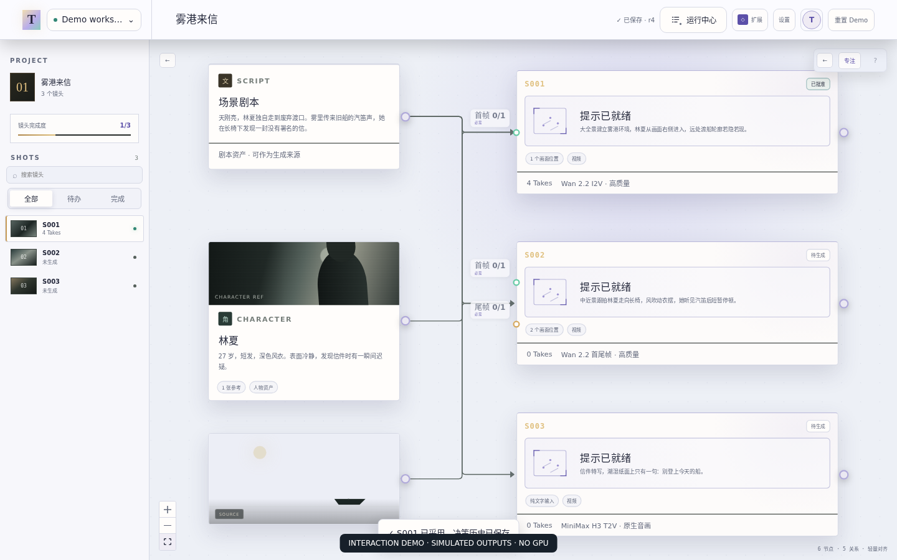

# TakeBoard

English · <a href="README.md">简体中文</a>

**One canvas for AI image and video creation.**

TakeBoard is an open-source AI creation canvas built on ComfyUI. Choose models, connect media, write prompts and generate images or videos in one workspace. Use a result in your next generation, or explore several directions side by side. The desktop app connects to your own local or remote ComfyUI.

[**Download beta**](docs/downloads.en.md) · [Interaction demo](docs/demo-guide.md#english) · [Get started](docs/first-session.md#english) · [Website](https://fourques.github.io/Takeboard/)

 

*Development-build UI with simulated results, not a model-output sample. [Demo scope and source](docs/demo-guide.md#english).*

## Why use TakeBoard?

Turn configured ComfyUI workflows into tools you can use on a creative canvas. Work on a single image or multiple video shots without returning to the underlying node graph for every attempt.

- **Create across connected steps.** Add reference images or videos, create generation nodes, connect inputs, adjust prompts and parameters, and view results. Keep multiple attempts or connect a result to another node to continue creating.
- **Choose models by task.** Text-to-image, image editing, text-to-video, image-to-video and reference generation expose the inputs and controls supported by the available workflow. Add recommended templates or import your own; open ComfyUI when you need to edit the graph.
- **Open source. Your own setup.** Run ComfyUI locally or on a remote GPU, and choose where projects live. A local project can collect outputs from remote generation. The source is open and no official cloud subscription is required.

For creators who want a visual image and video workspace while keeping control over their ComfyUI workflows. An existing ComfyUI setup is the quickest way to start generating; you can explore the canvas and media tools before connecting one.

## Get started

The current public release is [**v0.2.0-beta.19**](https://github.com/Fourques/Takeboard/releases/tag/v0.2.0-beta.19). Installers are available for macOS, Windows and Debian/Ubuntu on x64 and ARM64. They include the app runtime; no development tools are needed.

The app interface is currently primarily Chinese. This overview, the website and getting-started materials are available in English.

1. [Install TakeBoard](docs/downloads.en.md), create a project and choose its save location.
2. Connect your existing ComfyUI in Settings and add a workflow suited to that device.
3. Create a shot, choose its generation type and an available workflow, connect the required media, write a prompt and generate.
4. Review the result and its record. Keep the version you want or use it as the input for another attempt.

Local use needs no account. **ComfyUI, models and custom nodes are not bundled.** Without a generation setup, you can still try media import, the canvas and project saving. Mac packages are not Apple-notarized and Windows packages are not commercially code-signed; see [first-launch help](docs/downloads.en.md#install-and-open).

## Workflows and requirements

- **Add recommended templates when you need them.** Adaptations include Qwen Image, MiniMax H3, Wan 2.2 and LTX 2.3. Availability depends on the models and nodes installed on the generation device.
- **Import your own workflows.** TakeBoard accepts Workflow JSON, API Prompt JSON and PNGs containing workflow metadata. It checks dependencies and inputs; custom workflows may need confirmed parameter bindings and execution trust. For graphs it cannot convert, export API format from ComfyUI and import that instead.
- **Currently in beta.** Input capabilities and hardware requirements vary by workflow. Start with one compatible workflow. [Workflow guide](docs/creator-workstation.md) · [Compatibility record](docs/compatibility-matrix.md) (Chinese).

beta.19 includes the latest Fastify security fixes. Updating older versions is recommended. See the [changelog](CHANGELOG.md) for release details.

## Go further

| What you want to do | Start here |
| --- | --- |
| Complete a first generation | [First session](docs/first-session.md#english) · [Practical guide](https://fourques.github.io/Takeboard/guides/organize-comfyui-results/) |
| Connect a laptop to a GPU server | [Generation devices and project storage](docs/generation-and-storage.md) (Chinese) |
| Change storage, back up or update | [Settings](docs/settings-and-updates.md) · [Data layout](docs/data-layout.md) (Chinese) |
| Share or self-host projects | [Access control](docs/access-control.md) · [Self-hosting](docs/self-hosting.md) (Chinese) |
| Use optional tools or contribute | [Extensions](docs/extensions.md) (Chinese) · [Contributing](CONTRIBUTING.md) · [Documentation](docs/README.md) |

If something fails, run diagnostics from Settings or [tell us which step blocked you](https://github.com/Fourques/Takeboard/issues/new?template=first_try.yml). You do not need to diagnose it first. Remove private media and credentials from public reports.

Code is licensed under [Apache-2.0](LICENSE). Models and custom nodes have their own licenses. TakeBoard is an independent project, not affiliated with Comfy Org. [Security reports](SECURITY.md) · [Roadmap](docs/roadmap.md)
