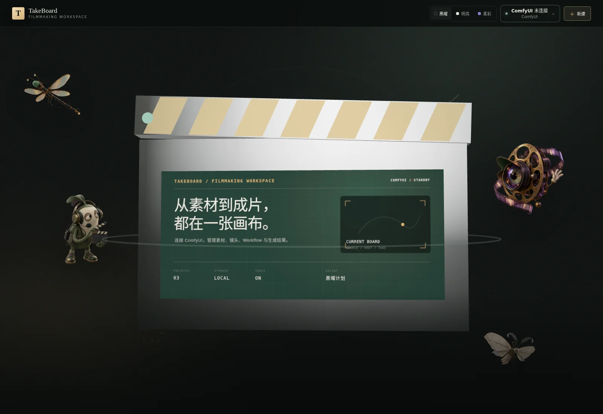

# TakeBoard

<p align="center">
  <strong>把素材、镜头、工作流与每一次生成，放回同一张导演板。</strong><br />
  面向 ComfyUI 创作者的开源、本地优先 AI 影像工作台。
</p>

<p align="center">
  <a href="https://github.com/Fourques/Takeboard/actions/workflows/ci.yml"></a>
  <a href="LICENSE"></a>
  
  
</p>



TakeBoard 不重做 ComfyUI 的节点系统。它在现有 Workflow 和算力之上补充项目层：管理角色、场景、道具、镜头、Run、候选 Take 与最终选片，并保留每个结果的来源关系。

模型、工作流、素材和项目文件始终保存在自己的设备上。没有 ComfyUI 时，也可以完整使用项目管理和画布界面。

> [!IMPORTANT]
> 当前版本适合个人创作和可信团队试用，尚未提供账号与权限系统。服务默认只监听 `127.0.0.1`；请使用 Tailscale 或 SSH 隧道远程访问，不要直接开放到公网。

## 能力概览

- 以可旋转的导演板作为项目入口，在同一界面创建、预览、重命名和删除项目；
- 为每个项目维护独立画板、素材库、镜头、Workflow、Run 与 Take；
- 用首帧、尾帧和参考输入等影视语义连接素材与镜头；
- 检测和导入 ComfyUI Workflow，仅展示创作阶段真正需要的参数；
- 执行文生图、图生图、图生视频和首尾帧视频任务；
- 跟踪进度、取消任务、回收结果，并保存可复现的参数快照；
- 以独立 `.takeboard` 目录保存项目，方便备份、迁移和版本归档。

```text
角色 / 场景 / 道具 / 参考图
              │
              ├── 首帧 / 尾帧 / 参考输入
              ▼
Project → Scene → Shot → Run → Take → Approved Take
                         │
                         └── ComfyUI Recipe / Workflow
```

## 快速开始

环境要求：Node.js `>= 22.12 < 27`、Corepack，以及可选的 ComfyUI。

```bash
git clone https://github.com/Fourques/Takeboard.git
cd Takeboard
corepack enable
pnpm install --frozen-lockfile
./scripts/takeboard dev
```

打开 <http://127.0.0.1:48110>。结束开发进程后，脚本会自动恢复先前运行的稳定服务，避免开发端口与日常使用互相冲突。

## 日常运行

### 本机稳定使用

Linux 主机推荐安装用户级 systemd 服务：

```bash
./scripts/takeboard install
./scripts/takeboard open
```

服务会随用户会话启动、异常后自动恢复，并固定监听 <http://127.0.0.1:48120>。常用操作统一由一个入口完成：

```bash
./scripts/takeboard status
./scripts/takeboard restart
./scripts/takeboard logs
./scripts/takeboard doctor
```

配置文件位于 `~/.config/takeboard/env`，修改后运行 `./scripts/takeboard restart` 生效。

### Tailscale 远程访问（推荐）

服务器和自己的电脑加入同一 tailnet 后，在服务器执行一次：

```bash
./scripts/takeboard-share enable
```

脚本会输出稳定的私有 HTTPS 地址。之后无需保持 SSH 窗口，也不用记端口；访问仍受 tailnet 身份与 ACL 控制。查看或关闭共享：

```bash
./scripts/takeboard-share status
./scripts/takeboard-share disable
```

### SSH 隧道回退

无法使用 Tailscale Serve 时，在 Mac 或 Linux 客户端的项目目录执行：

```bash
./scripts/takeboard-tunnel start your-server
```

默认打开 `48220`。如果端口已被 VS Code 或旧隧道占用，脚本会自动选择下一个可用端口，并同时转发 ComfyUI 到 `48188`：

```bash
./scripts/takeboard-tunnel status
./scripts/takeboard-tunnel open
./scripts/takeboard-tunnel stop
```

完整场景、故障诊断与安全边界见[远程访问指南](docs/remote-access.md)。

## 连接 ComfyUI

开发模式可以直接设置环境变量：

```bash
export COMFY_URL=http://127.0.0.1:8188
export COMFY_EDITOR_URL=http://127.0.0.1:48188
export COMFY_INPUT_ROOT=/path/to/ComfyUI/input
export COMFY_OUTPUT_ROOT=/path/to/ComfyUI/output
./scripts/takeboard dev
```

稳定服务则编辑 `~/.config/takeboard/env`。其中 `COMFY_URL` 是服务端访问的 API 地址，`COMFY_EDITOR_URL` 是用户浏览器打开编辑器时使用的地址；远程部署时两者通常不同。配置输入和输出根目录后，TakeBoard 才会清理由本次 Run 创建的临时文件。

模型与 Custom Node 的可用性取决于自己的 ComfyUI 环境。TakeBoard 不会自动下载来源不明的模型或节点。

## 项目数据

```text
TAKEBOARD_DATA_ROOT/
└── my-film.takeboard/
    ├── project.takeboard.json
    ├── takeboard.db
    ├── assets/
    ├── renders/
    ├── runs/
    ├── recipes/
    ├── logs/
    └── exports/
```

每个项目都是完整、可独立备份的目录。迁移时应复制整个 `.takeboard` 目录，而不是只复制数据库。详见[数据目录规范](docs/data-layout.md)。

## 架构

```text
React 19 · Vite · React Flow · Three.js
                    │
                    ▼
             Fastify Local API
        ┌───────────┼───────────┐
        ▼           ▼           ▼
  SQLite/Drizzle  Asset Store  Recipe Registry
                                  │
                                  ▼
                         ComfyUI Executor
```

| 目录 | 职责 |
| --- | --- |
| `apps/web` | 项目主页、内容画布、资产库与运行交互 |
| `apps/server` | 本地 API、项目持久化、媒体管理与任务编排 |
| `packages/contracts` | 前后端共享契约 |
| `packages/domain` | Project、Shot、Run、Take 等领域模型 |
| `packages/executor-comfy` | Workflow 检测、参数注入与 ComfyUI 适配 |

更多设计边界见[技术架构](docs/architecture.md)。

## 开发与验证

```bash
pnpm verify       # lint + typecheck + build + unit/integration tests
pnpm test:e2e     # Playwright 浏览器流程
pnpm format       # 格式化代码
```

首次运行浏览器测试前执行 `pnpm exec playwright install chromium`。服务器已有 Chrome 时，也可以通过 `PLAYWRIGHT_CHROMIUM_EXECUTABLE_PATH=/usr/bin/google-chrome` 指定现有浏览器。

提交 Workflow 兼容性问题时，请附上 ComfyUI 版本、相关 Custom Node、期望输入输出和脱敏后的复现步骤；不要提交 API Key、私有素材或其他凭据。

## 文档

| 文档 | 内容 |
| --- | --- |
| [创作工作站](docs/creator-workstation.md) | 画布、素材、Workflow 与生成流程 |
| [远程访问](docs/remote-access.md) | Tailscale Serve、SSH 回退与端口诊断 |
| [自托管部署](docs/self-hosting.md) | systemd、配置、升级与运行维护 |
| [数据目录](docs/data-layout.md) | 项目隔离、备份与迁移 |
| [技术架构](docs/architecture.md) | 模块边界、数据流与安全约束 |
| [开发路线图](docs/roadmap.md) | Gate、验收标准与后续方向 |

## 路线图

- [x] 多项目主页、预览与项目管理
- [x] 内容画布、素材节点与语义连线
- [x] Workflow 检测、导入和常用参数映射
- [x] ComfyUI 任务、取消、结果回收与 Take 管理
- [ ] 稳定的 Recipe Contract 与社区 Recipe 示例
- [ ] 分镜墙、整片覆盖率和只读粗剪
- [ ] 多 Worker、远程算力与可解释的执行策略
- [ ] 完整项目导入导出、成本统计与跨镜头审批

## License

[Apache License 2.0](LICENSE)
